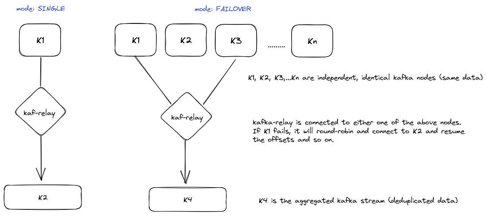

<a href="https://zerodha.tech"></a>
## kaf-relay

kaf-relay is an opinionated, high performance program for keeping Kafka clusters in sync by replicating topics. It is specfically designed for high-availability with background healthchecks, offset tracking, and topic lag checks.

### Features

* Topic Forwarding: Relay consumes messages from topics in one Kafka cluster and forwards them to topics in another Kafka cluster.
* Authentication: PLAIN, SCRAM-SHA-256, SCRAM-SHA-512
* Topic Remapping: Relay allows you to specify topic remappings, enabling you to map a topic from the source cluster to a different topic in the destination cluster.
* Consumer group failover: Given identical Kafka instances (separate nodes 1...N) at the upstream, instantly switch over to the next node in a round-robin fashion on current node failure. Offset tracking between source and target nodes allows de-duplication without external stores.
* Topic lag failover: Monitors offsets amongst N identical nodes to detect lags and to instantly switch upstream consumer nodes.
* Stop at end: Flag `--stop-at-end` allows the program to stop after reaching the end of consumer topic offsets that was picked up on boot.
* Filter messages using go plugins: Flag `--filter` allows the program to filter messages based on the logic in plugin code.

#### kaf-relay in different modes




## Usage

To run kaf-relay, follow these steps:

Copy config.sample.toml to config.toml and edit it accordingly. Then run:

```bash
./kaf-relay.bin --config config.toml --mode <single/failover>
```

### Filter plugins

Plugins allow to parse and filter incoming messages to allow or deny them from being replicated downstream. Build your own filter plugins by implementing `filter.Provider` interface.

Sample
```golang
package main

import (
	"encoding/json"
)

type TestFilter struct {
}

type Config struct {
}

func New(b []byte) (interface{}, error) {
	var cfg Config
	if err := json.Unmarshal(b, &cfg); err != nil {
		return nil, err
	}

	return &TestFilter{}, nil
}

func (f *TestFilter) ID() string {
	return "testfilter"
}

func (f *TestFilter) IsAllowed(msg []byte) bool {
	return false
}
```
* Copy this plugin code to a directory. `mkdir testfilter && cp sample.go testfilter`
* Build the plugin. `CGO_ENABLED=1 go build -a -ldflags="-s -w" -buildmode=plugin -o testfilter.filter sample.go`
* Change the config.toml to add the filter provider config.
* Run kaf-relay with the filter plugin. `./kaf-relay.bin --mode single --stop-at-end --filter ./testfilter/testfilter.filter`

## Using as a library

The `pkg/relay` and `pkg/kafkatarget` packages can be imported to build custom relay daemons. The builtin Kafka target can be swapped for any backend by implementing the `relay.Target` interface.

Here is an example that shows a Redis target.

```go
package main

import (
	"context"
	"fmt"
	"log/slog"
	"strconv"

	"github.com/redis/go-redis/v9"
	"github.com/zerodha/kaf-relay/pkg/relay"
)

const watermarkKey = "_watermark" // Redis hash: topic -> partition -> offset

// RedisTarget implements relay.Target, writing messages to Redis streams
// and tracking offsets in a Redis hash for resumption.
type RedisTarget struct {
	client *redis.Client
	topic  string
	log    *slog.Logger
	stopCh chan struct{}
	doneCh chan struct{}
}

func NewRedisTarget(addr, topic string, log *slog.Logger) *RedisTarget {
	return &RedisTarget{
		client: redis.NewClient(&redis.Options{Addr: addr}),
		topic:  topic,
		log:    log,
		stopCh: make(chan struct{}),
		doneCh: make(chan struct{}),
	}
}

// GetHighWatermark reads persisted offsets from a Redis hash for the relay to resume from the last checkpoint.
func (r *RedisTarget) GetHighWatermark(ctx context.Context) (relay.Offsets, error) {
	vals, err := r.client.HGetAll(ctx, watermarkKey).Result()
	if err != nil {
		return nil, err
	}

	offsets := make(map[int32]int64, len(vals))
	for field, val := range vals {
		p, _ := strconv.Atoi(field)
		o, _ := strconv.ParseInt(val, 10, 64)
		offsets[int32(p)] = o
	}

	return relay.Offsets{r.topic: offsets}, nil
}

// Start blocks until Close() is called.
func (r *RedisTarget) Start() error {
	defer close(r.doneCh)
	<-r.stopCh
	return nil
}

// Write writes a message to Redis and updates the watermark offset.
func (r *RedisTarget) Write(ctx context.Context, msg relay.Message) error {
	pipe := r.client.Pipeline()

	pipe.XAdd(ctx, &redis.XAddArgs{
		Stream: msg.Topic,
		Values: map[string]interface{}{
			"key":   string(msg.Key),
			"value": string(msg.Value),
		},
	})

	// Persist the source offset for GetHighWatermark() (for relay resumption).
	pipe.HSet(ctx, watermarkKey, fmt.Sprintf("%d", msg.Partition), msg.Offset)

	_, err := pipe.Exec(ctx)
	return err
}

// Close signals Start() to return and waits for it and closes the Redis client.
func (r *RedisTarget) Close() error {
	close(r.stopCh)
	<-r.doneCh
	return r.client.Close()
}
```

Connect it to the relay.

```go
target := NewRedisTarget("localhost:6379", log)

srcPool, _ := relay.NewSourcePool(poolCfg, consumerCfgs, topic, nil, metricsSet, log)

r, _ := relay.NewRelay(relayCfg, srcPool, target, topic, nil, metricsSet, log)
r.Start(ctx)
```

## Metrics

Replication metrics are exposed through a HTTP server.

```
$ curl localhost:7081/metrics
kafka_relay_msg_count{source="topicA", destination="machineX_topicA", partition="0"} 44
kafka_relay_msg_count{source="topicA", destination="machineX_topicA", partition="1"} 100
kafka_relay_msg_count{source="topicA", destination="machineX_topicA", partition="2"} 100
kafka_relay_msg_count{source="topicA", destination="machineX_topicA", partition="3"} 44
kafka_relay_msg_count{source="topicA", destination="machineX_topicA", partition="4"} 44
kafka_relay_msg_count{source="topicA", destination="machineX_topicA", partition="5"} 100
```
